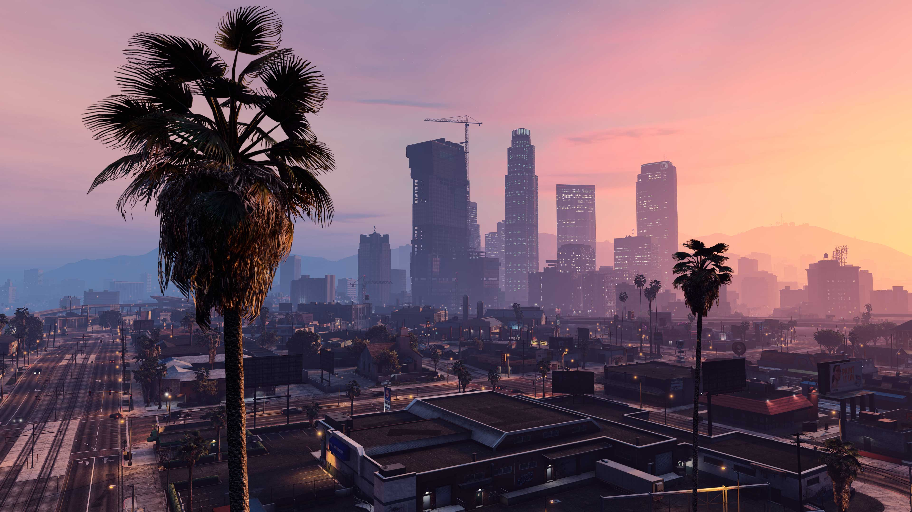
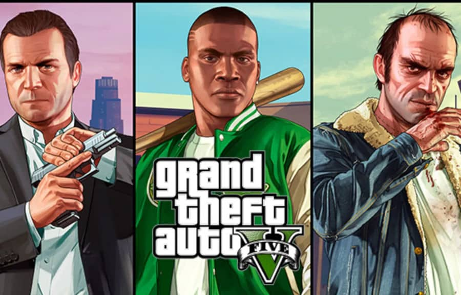

# Grand Theft Auto V (GTA V)

## Opis gry

Grand Theft Auto V to popularna gra akcji z otwartym światem, stworzona przez studio Rockstar Games. Akcja gry toczy się w fikcyjnym stanie San Andreas, wzorowanym na południowej Kalifornii. Gracz ma ogromną swobodę poruszania się po świecie gry oraz wykonywania misji głównych i pobocznych.

Gra oferuje realistyczną grafikę, rozbudowaną fabułę oraz dużą liczbę aktywności, takich jak wyścigi, napady, strzelaniny czy eksploracja miasta. GTA V jest jedną z najlepiej sprzedających się gier w historii.

## Fabuła

Fabuła GTA V skupia się na losach trzech głównych bohaterów: Michaela De Santa, Franklina Clintona oraz Trevora Philipsa. Każda z postaci ma własną historię, osobowość oraz motywacje, a ich losy wzajemnie się przeplatają.

Gracz bierze udział w spektakularnych napadach, konfliktach gangów oraz ucieczkach przed organami ścigania. Historia porusza tematy przestępczości, korupcji i amerykańskiego snu, często w satyryczny sposób.

## Mechanika

GTA V oferuje rozgrywkę z perspektywy trzeciej lub pierwszej osoby. Gracz może swobodnie przełączać się pomiędzy trzema bohaterami, co jest jedną z kluczowych mechanik gry. Każda postać posiada unikalne umiejętności specjalne.

Gra zawiera rozbudowany system walki, prowadzenia pojazdów oraz interakcji z otoczeniem. Dodatkowo dostępny jest tryb sieciowy **GTA Online**, który umożliwia wspólną grę z innymi graczami.

## Zasoby online

- [Oficjalna strona GTA V](https://www.rockstargames.com/gta-v)
- [Recenzja gry na Metacritic](https://www.metacritic.com/game/grand-theft-auto-v/)

| Rok wydania | Platformy                                   | Oceny        |
|-------------|----------------------------------------------|--------------|
| 2013        | PC, PlayStation 3/4/5, Xbox 360/One/Series X | 9.5/10       |

[Powrót do strony głownej](index.md)