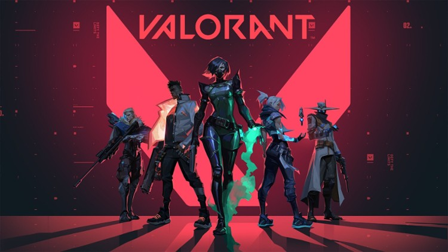
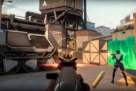

# Valorant

Valorant to taktyczna strzelanka pierwszoosobowa (FPS), która stała się jednym z filarów współczesnego e-sportu. Wyprodukowana przez studio Riot Games, twórców League of Legends, gra łączy precyzyjne strzelanie z unikalnymi umiejętnościami postaci. W meczach rywalizują dwie drużyny po pięciu graczy: jedna atakuje, próbując podłożyć "Spike'a", a druga broni obszarów mapy.

Gra wyróżnia się niskim progiem wejścia sprzętowego, ale niezwykle wysokim sufitem umiejętności (tzw. skill ceiling). Wymaga nie tylko celnego oka, ale przede wszystkim komunikacji głosowej, zgrania zespołu i strategicznego zarządzania ekonomią w trakcie meczu.

## Mapy i Strategia

W przeciwieństwie do otwartych światów, w Valorancie akcja dzieje się na zamkniętych arenach. Od pustynnego Bind z teleportami, przez lewitujące miasto Ascent, aż po podwodne Pearl – każda mapa wymusza inne podejście taktyczne. Znajomość "kątów" (angles), linii strzału oraz momentów na użycie dymu czy błysku jest kluczem do zwycięstwa.

## Strzelanie i Umiejętności

Bycie dobrym agentem to nie tylko refleks. Mechanika strzelania („gunplay”) jest surowa i nie wybacza błędów – liczy się kontrola odrzutu i strzelanie w głowę („headshoty”). Każda postać posiada jednak zestaw 4 umiejętności: od ścian leczących, przez drony zwiadowcze, aż po potężne ataki obszarowe (Ultimates). Umiejętności te mają jednak wspierać strzelanie, a nie je zastępować.

## Rywalizacja ponad wszystko

To, co przyciąga do Valoranta, to tryb rankingowy. Gracze pną się po drabinie rang – od Żelaza aż po Promienistego (Radiant). Każdy mecz jest inny dzięki różnorodności agentów i ich kombinacji. Emocje sięgają zenitu zwłaszcza w sytuacjach "Clutch", gdy jeden gracz musi pokonać kilku przeciwników, by wygrać rundę dla swojej drużyny.

## Skórki i E-sport

Gra słynie z niezwykle dopracowanych skórek do broni, które zmieniają animacje i dźwięki, stając się obiektem pożądania graczy. Valorant to także potężna scena e-sportowa z cyklem turniejów Valorant Champions Tour (VCT), gdzie najlepsze drużyny świata walczą o milionowe nagrody i tytuł mistrza świata.

### Główne klasy postaci (Agenci)

| Klasa | Rola | Przykładowy Agent | Opis |
| :--- | :--- | :--- | :--- |
| **Szturmowiec** | Duelist | **Jett** | Zabójczyni, która wchodzi pierwsza do walki, robiąc miejsce dla drużyny. |
| **Strażnik** | Sentinel | **Sage** | Ekspertka od obrony terenu, leczenia sojuszników i spowalniania wrogów. |
| **Inicjator** | Initiator | **Sova** | Zbiera informacje o pozycji wroga (np. strzałą wykrywającą) przed atakiem. |
| **Kontroler** | Controller | **Omen** | Zasłania widoczność wroga dymem, pozwalając drużynie bezpiecznie przejąć punkt. |

### Przydatne linki:

1. [Oficjalna strona gry Valorant](https://playvalorant.com/pl-pl/)
2. [Statystyki graczy (Tracker.gg)](https://tracker.gg/valorant)

[Wróć do strony głównej](index.md)